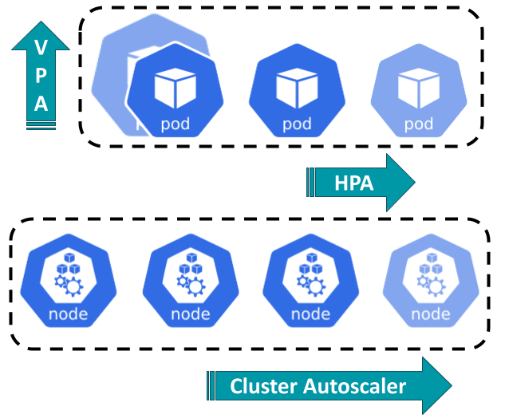

# Auto-scaling

This section describes the different scaling strategies in Kubernetes.

## Index

- [Auto-scaling](#auto-scaling)
  - [Index](#index)
  - [Kubernetes auto-scaling](#kubernetes-auto-scaling)
  - [Vertical Pod Autoscaler (VPA)](#vertical-pod-autoscaler-vpa)
    - [Installation](#installation)
    - [How it works](#how-it-works)
  - [Horizontal Pod Autoscaler (HPA)](#horizontal-pod-autoscaler-hpa)
  - [Cluster Autoscaler](#cluster-autoscaler)

## Kubernetes auto-scaling

Automatic scaling in Kubernetes is done through *controllers* (extensions of vanilla K8S) and is split as follows:

- Cluster (nodes)
  - Horizontal scaling with *Cluster Autoscaler*
  - Advanced scaling with *Karpenter* or similar tools
- Workload (pods)
  - Horizontal scaling with *HPA*
  - Vertical scaling with *VPA*

The following diagram depicts the scaling options in Kubernetes:

<!-- markdownlint-disable-next-line -->

## Vertical Pod Autoscaler (VPA)

It is an official offering, just like *Cluster Autoscaler*, but it is not as stable or adopted as *HPA* (its horizontal counterpart), the main drawback being pod restarts on resource edits. As of Kubernetes v1.33 though, there's a beta function for updates in-place and VPA is already offering that as beta too, so in the future it might be stable.

### Installation

The K8s teams offers no Helm chart, but the Fairwinds company, creators of Goldilocks, are offering a chart that seems legit. VPA has a prerequisite that is having the Metric server installed, which has a chart available by Kubernetes SIGs (special interest groups), the same offering External DNS, so it is also legit.

### How it works

Once a VPA CRD is set on a deployment, it can either recommend or enforce resource assignments based on consumption, for both upscaling and downscaling, within bounds defined by the user. It does not work well with HPA looking at the same metric, but could be combined with HPA if both were looking at separate metrics (custom, memory or cpu).

## Horizontal Pod Autoscaler (HPA)

TBD

## Cluster Autoscaler

TBD
