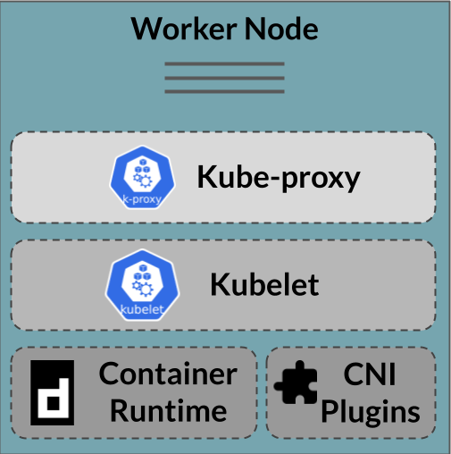

# Worker nodes

## Index

- [Kubelet](#kubelet)
- [Container Runtime](#container-runtime)
- [Network plugins - CNI](#network-plugins---cni)
- [Container Runtime Interface (CRI)](#container-runtime-interface-cri)
  - [Crictl](#crictl)

## Kubelet

A Kubelet is the node-side agent of Kubernetes, which allows the node to lend its resources to a Kubernetes cluster, when it joins it. This component on its own does not host containers, on the contrary, it is bound to have a Container Runtime installed by its side, which it uses to host containers on.

A fun, but not minor, fact is that worker nodes don't really need the Control Plane (or to be part of a cluster, for that matter) to host containers; they have a working Container Runtime in place and that's all they need. In fact, on some deployment models of Kubernetes, this is used as a strategy to bootstrap "all-in-one" nodes with [static pods](https://kubernetes.io/docs/tasks/configure-pod-container/static-pod/).

The following diagram depicts the worker node architecture:

<!-- markdownlint-disable-next-line -->


## Container Runtime

A Container Runtime or Engine is, simply put, a software that runs containers based on container images (as explained on the [Containers section](containers.md)). The famous Docker is a great example of this, and, in fact, it was used on earlier versions of Kubernetes as the runtime; nowadays, most clusters leverage Containerd (which derived from Docker) and CRI-O (newer player by RedHat).

So, Kubernetes orchestrates containers that it runs remotely on worker nodes (through the Kubelet), which they run on top of a Container Runtime. And here lies *part* of the value of Kubernetes when compared with a raw Container Engine: Its capacity to coordinate running containers at scale on distributed compute.

## Network plugins - CNI

The networking of containers in Kubernetes is done based on the [CNI specification](https://github.com/containernetworking/cni), which ensures that the [Kubernetes network model](https://kubernetes.io/docs/concepts/services-networking/#the-kubernetes-network-model) is followed (each pod gets its own IP address and is reachable/can reach all other pods).

To comply with the above model, clusters can use different strategies, and this is yet another area where Kubernetes has many flavors. Kubernetes is agnostic to the CNI strategy in use and it abstracts itself from it by adding an extra layer called the [network plugins](https://kubernetes.io/docs/concepts/extend-kubernetes/compute-storage-net/network-plugins/), a few binaries (with predefined interfaces) used by the Container Runtime to connect pods to the network, and a JSON configuration file. This makes the network plugins another prerequisite for worker nodes.

To put it briefly: The Container Runtime will expect the CNI binaries at a path like `/opt/cni/bin` and the config at a path like `/etc/cni/net.d`, and invoke them when running pods.

## Container Runtime Interface (CRI)

The [CRI](https://kubernetes.io/docs/concepts/architecture/cri/) is an abstraction layer for the Kubelet to interact with underlying node's Container Runtime, detaching the Kubernetes components from the runtime; this communication is done locally over an UDS *Socket* (e.g. `/run/containerd/containerd.sock`) and using the *gRPC* protocol.

A [handful](https://kubernetes.io/docs/setup/production-environment/container-runtimes/) of Container Runtimes are supported (CRI-compliant), in order of popularity:

- [Containerd](https://containerd.io/) (used by AKS, EKS and GKE)
- [CRI-O](https://cri-o.io/) (used by OpenShift)
- [Docker Engine](https://docs.docker.com/engine/) with a CRI addon
- [Mirantis](https://www.mirantis.com/software/mirantis-container-runtime/)

Example of running the Kubelet with the CRI-O runtime:

```bash
kubelet --container-runtime-endpoint /var/run/crio/crio.sock
```

A simple way to check if the runtime is listening on the sock is to make an HTTP request to the unix socket. If an application-layer (L7) response like an HTTP error (because we're not using gRPC) is returned, then there's something listening:

```bash
curl --unix-socket /var/run/crio/crio.sock localhost
# Responds HTTP 404
```

### Crictl

A CLI tool called [crictl](https://github.com/kubernetes-sigs/cri-tools) was developed by the Kubernetes community, which allows for interacting with a CRI compatible Container Runtime, much like you would do with the Docker engine when using `docker`. This is a very handy debugging tool to use locally at the nodes, as it works with sockets.
